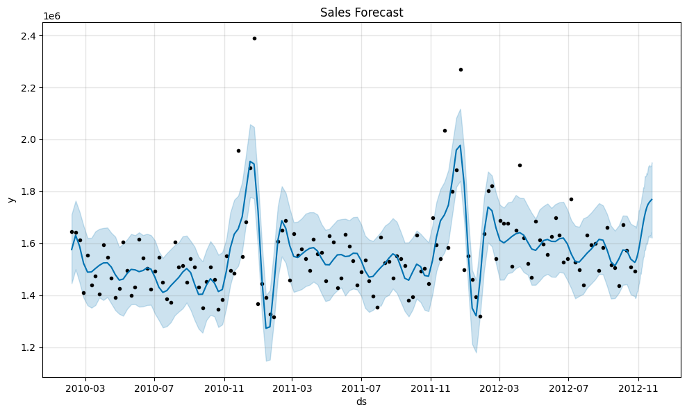

# Sales-Forcasting
Sales forecasting project using time series analysis with prophet

 Dataset
- Walmart Sales Dataset (45 stores)
- Contains:
  - Date
  - Weekly Sales
  - Temperature
  - Fuel Price
  - CPI
  - Unemployment

Tech Stack
- Python  
- Pandas  
- Prophet (Facebook Prophet)  
- Matplotlib  

 Approach
1. Data Cleaning & Preprocessing  
2. Converted date column to datetime format  
3. Selected one store for consistent time-series  
4. Renamed columns for Prophet (`ds`, `y`)  
5. Built forecasting model using Prophet  
6. Generated future predictions  

 Results
- Forecasted future 30 days of sales  
- Model captures overall trend and seasonal patterns  

 Visualization

### Sales Forecast using Time-Series analysis

 Insights
- Sales show seasonal spikes  
- Sudden peaks likely due to holidays/promotions  
- Model captures long-term trend effectively  

